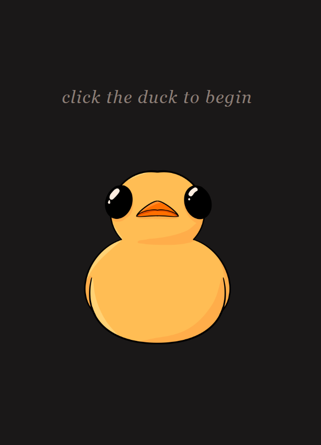

# Ducks in a Row

An AI scheduling assistant powered by a wise, slightly intimidating rubber duck. Speak to the duck about your day — it asks focused questions about your tasks, energy level, and time available, then builds you a realistic schedule with breaks built in.

<center>

</center>

---

## AI Components

| # | Component | What it does |
|---|-----------|-------------|
| 1 | **Groq Whisper** (speech-to-text) | Transcribes the user's spoken audio to text |
| 2 | **Groq Llama 3.3-70B** (LLM) | Plays the duck persona, gathers scheduling info, emits a structured JSON schedule |
| 3 | **Google Cloud TTS** (text-to-speech) | Speaks the duck's reply back to the user in a deep, calm voice |

---

## How It Works

```
User clicks duck → mic records → POST /transcribe
                                        │
                              Groq Whisper → text
                                        │
                              Groq Llama → duck reply + optional schedule JSON
                                        │
                              POST /tts → Google TTS → base64 MP3
                                        │
                              Duck speaks reply aloud
                                        │
                    (repeat until duck has enough info)
                                        │
                              Schedule JSON detected
                                        │
                              Schedule page renders:
                                 [Calendar] [Tasks] [Duck]
```

---

## Setup

See [DEVELOPER.md](DEVELOPER.md) for full instructions from clone to running demo.

Quick version:

```bash
npm install
# create .env with GROQ_API_KEY and GOOGLE_TTS_KEY
npm run dev        # open http://localhost:5173
```

---

## Project Structure

```
ducks-in-a-row/
├── server.js               Express API server (port 3000)
├── vite.config.js          Vite build config (React frontend)
├── services/
│   ├── transcription.js    Groq Whisper — audio → text
│   ├── rubberDucky.js      Groq Llama — conversation + schedule JSON
│   └── tts.js              Google Cloud TTS — text → MP3 audio
├── client/
│   ├── index.html
│   ├── public/duck.png     Duck illustration
│   └── src/
│       ├── App.jsx                         Page router + help modal trigger
│       ├── pages/
│       │   ├── ConversationPage.jsx        Opening screen — talk to the duck
│       │   └── SchedulePage.jsx            3-column plan view
│       ├── components/
│       │   ├── DuckButton.jsx              Animated duck button (large + small variants)
│       │   ├── DuckPanel.jsx               Compact duck interaction on the schedule page
│       │   ├── HelpModal.jsx               "How it works" overlay
│       │   ├── ScheduleCalendar.jsx        Hourly day-view timeline
│       │   ├── TaskDetailModal.jsx         Per-task tips + notes overlay
│       │   └── TodoList.jsx                Interactive task checklist
│       ├── utils/
│       │   ├── priorityColors.js           Shared priority → color map
│       │   └── scheduleCalendarUtils.js    Time/offset math for the calendar
│       └── hooks/
│           ├── useRecorder.js              MediaRecorder wrapper
│           ├── useSession.js               Session ID persistence
│           └── useAudioPlayback.js         Base64 MP3 playback
└── tests/
    ├── unit/               Vitest — services tested in isolation
    ├── integration/        Vitest + Supertest — Express routes
    └── e2e/                Playwright — full browser tests
```

---

## Scripts

| Command | What it does |
|---------|-------------|
| `npm run dev` | Start Express + Vite together (development) |
| `npm test` | Run unit and integration tests |
| `npm run test:e2e` | Run Playwright browser tests |
| `npm run test:coverage` | Run tests with coverage report |
| `npm run build` | Build React app to `client/dist/` |
