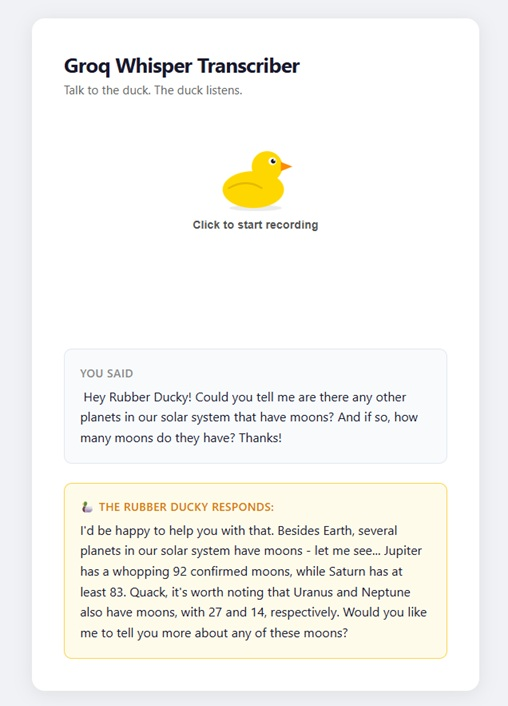

# Groq Whisper Transcription Demo

A simple demo showing how to use the [Groq Whisper API](https://console.groq.com/docs/speech-text) for speech-to-text transcription — both as a standalone script and as a small web app.

<center>

</center>

---

## Project Structure

```
groq-whisper-tts-demo/
│
├── .env                        # Your secret API key (never commit this!)
│
├── main.js                     # Standalone script — transcribes a fixed file and
│                               # prints the result to the console. Good reference
│                               # for understanding the core Groq API call.
│
├── server.js                   # Express web server — serves the frontend and
│                               # coordinates the two backend services.
│
├── services/                   # Backend services (Node.js, run on the server)
│   ├── transcription.js        # Groq Whisper logic (audio → text)
│   └── rubberDucky.js          # Groq LLM logic (text → rubber ducky response)
│
├── public/                     # Frontend files (run in the browser)
│   ├── index.html              # HTML structure
│   ├── styles.css              # All CSS styling
│   ├── app.js                  # Main UI logic — handles button, fetch, results
│   ├── recorder.js             # AudioRecorder class — wraps MediaRecorder API
│   └── duck.svg                # Rubber duck image (the record/stop button)
│
├── data/
│   └── Test-Recording.m4a      # Sample audio file used by main.js
│
├── package.json                # Project metadata and npm scripts
└── README.md                   # This file
```

---

## How It Works

### Standalone script (`main.js`)

```
.env (API key)
     ↓
main.js → reads data/Test-Recording.m4a
        → sends to Groq Whisper API
        → prints transcription text to console
```

### Web app (full flow)

```
Browser                         server.js        services/            Groq API
─────────────────────────────   ──────────────   ──────────────────   ────────
app.js + recorder.js
  │
  │  User clicks duck button
  │
  ├─ recorder.js: getUserMedia() → mic permission popup
  │
  ├─ MediaRecorder captures audio chunks
  │
  │  User clicks again (or 60s limit hit)
  │
  ├─ recorder.js: assembles chunks → audio Blob
  │
  POST /transcribe ──────────────>│
  (multipart/form-data)           │
                                  ├─ transcription.js ──────────────> Whisper API
                                  │<── text ───────────────────────────────────│
                                  │
                                  ├─ rubberDucky.js ────────────────> LLM API
                                  │<── ducky ──────────────────────────────────│
                                  │
  <── { text, ducky } ────────────│
  │
  Display transcription + ducky response
```

---

## Setup

### 1. Install dependencies

```bash
npm install
```

### 2. Add your API key

Create a `.env` file in the project root (or edit the existing one):

```
GROQ_API_KEY=your_api_key_here
```

Get a free key at [console.groq.com](https://console.groq.com).

---

## Running

### Web app (recommended)

```bash
npm start
```

Then open [http://localhost:3000](http://localhost:3000) in your browser.

### Standalone script

```bash
npm run dev
```

Transcribes `data/Test-Recording.m4a` and prints the text to the console.

---

## Supported Audio Formats

`mp3`, `mp4`, `mpeg`, `mpga`, `m4a`, `wav`, `webm`, `ogg`, `flac`

Maximum file size: **25 MB** (Groq API limit).

---

## Key Dependencies

| Package | Purpose |
|---|---|
| `groq-sdk` | Official Groq client — wraps the API so you don't write raw HTTP requests |
| `dotenv` | Loads `.env` file into `process.env` |
| `express` | Web server framework |
| `multer` | Handles file uploads (multipart/form-data) |
